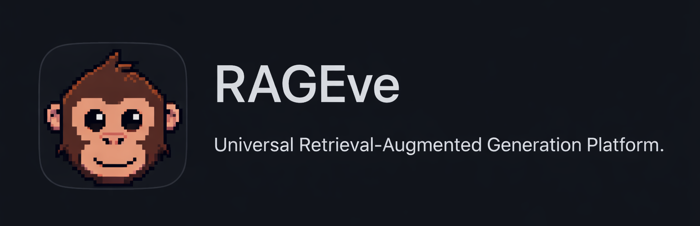
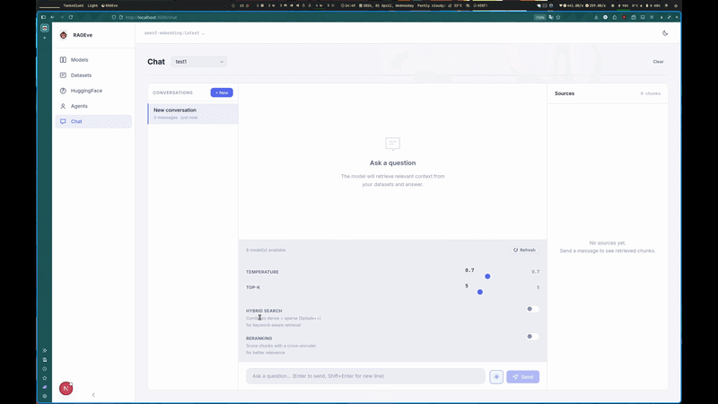
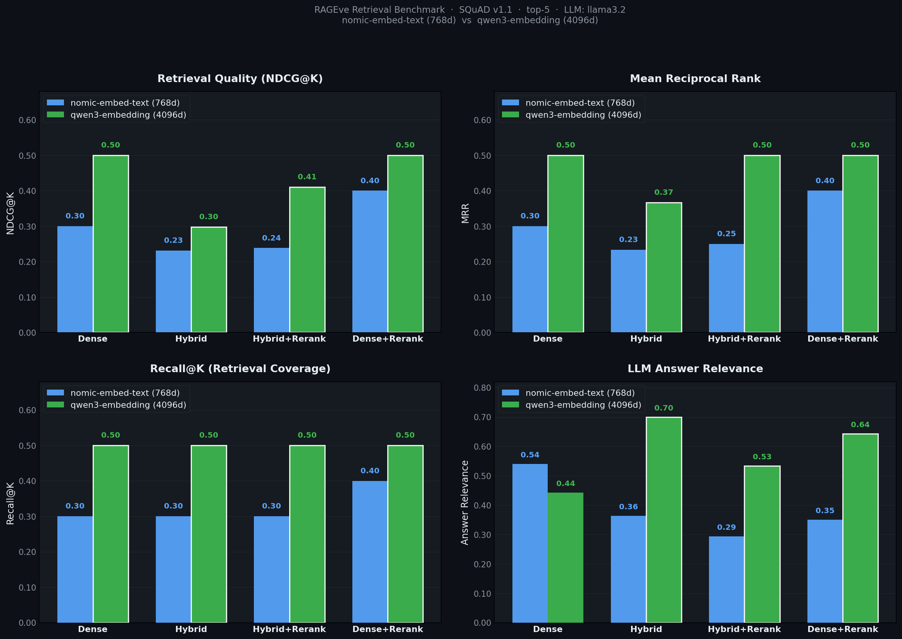

<!-- PROJECT BADGES -->
<div align="center">



**Local-first RAG platform — Fast, private, no cloud required.**

[](LICENSE)
[](pyproject.toml)
[](backend/main.py)
[](frontend)
[](https://ollama.com)

<a href="#-get-started">Get Started</a> ·
<a href="#-configurations">Configuration</a> ·
<a href="#-launch-service-from-source-for-development">Develop</a> ·
<a href="#-community">Community</a> ·
<a href="#-contributing">Contributing</a>

</div>

---

<details open>
<summary><b>📕 Table of Contents</b></summary>

- 💡 [What is RAGEve?](#-what-is-rageve)
- 🎮 [Demo](#-demo)
- 🔥 [Latest Updates](#-latest-updates)
- 🌟 [Key Features](#-key-features)
- 🔎 [System Architecture](#-system-architecture)
- 🎬 [Get Started](#-get-started)
  - 📝 [Prerequisites](#-prerequisites)
  - 🚀 [Quick Start](#-quick-start)
  - 🔧 [Configuration](#-configuration)
- 🔨 [Launch Service from Source for Development](#-launch-service-from-source-for-development)
  - [Backend only (technical users)](#-backend-only)
- 📜 [Roadmap](#-roadmap)
- 📊 [Benchmark](#-benchmark)
- 🏄 [Community](#-community)
- 🙌 [Contributing](#-contributing)

</details>

---

## 💡 What is RAGEve?

[RAGEve](https://github.com/bazzi24/RAGEve) is a **local-first RAG (Retrieval-Augmented Generation) platform** built for developers and teams who want the power of RAG workflows without depending on external cloud services.

It combines **Ollama** for local LLM inference and embeddings, **Qdrant** as a high-performance vector database, and **FastAPI + Next.js** for a full-featured web interface. Everything runs on your own machine — no API keys, no data leaves your network.

RAGEve is designed for two audiences:

| User | Experience |
|---|---|
| **Non-technical users** | `git clone && ./scripts/run.sh` — everything starts automatically |
| **Developers** | `./scripts/backend.sh` or manual `uvicorn` / `npm run dev` for full control |

---

## 🎮 Demo
<div align="center">
  
</div>

Start RAGEve locally and open [http://localhost:3000](http://localhost:3000):

```bash
git clone https://github.com/bazzi24/RAGEve.git
cd RAGEve
./scripts/run.sh
```

> **Tip:** On first run, `install.sh` automatically installs `uv`, Ollama, pulls the required models (~8 GB), and starts Docker services. This takes about 5–10 minutes once, then subsequent starts are instant.

---

## 🔥 Latest Updates

- **2026-04-03** Phase 24 — Evaluation matrix (16-cell benchmark) + Qdrant hybrid search fix
- **2026-04-01** Phase 23 — 9 production fixes: structured 500 handler, health checks, rate limiter proxy safety, request timeouts, streaming 404 fix, file upload limits, paginated datasets API
- **2026-04-01** Phase 22 — Chat history with MySQL/SQLite, session panel, per-agent conversations
- **2026-03-28** Phase 16 — Background HF dataset ingest with live progress tracking
- **2026-03-26** Phase 6c — Real-time streaming upload with per-batch progress stages
- **2026-03-26** Phase 7 — Cross-encoder reranking (sentence-transformers)
- **2026-03-25** Phase 3 — E2E test suite, conversation persistence


---

## 🌟 Key Features

### 🔍 **Deep Document Understanding**

- Ingest PDFs, Word docs, Excel, CSV, images, and more
- Adaptive chunking with quality scoring per profile (clean text, OCR noisy, table-heavy, code)
- Intelligent text column selection for multi-column datasets

### 🧠 **Grounded Answers with Citations**

- Exact chunk references from source documents
- Quality scores exposed to the LLM via enriched context
- Session history-aware chat with up to 6 prior turns in context

### ⚡ **Multiple Retrieval Strategies**

- Dense vector search via Ollama embeddings
- Sparse keyword search
- Hybrid fusion combining both with configurable weights
- Cross-encoder reranking for improved precision

### 🤖 **Flexible LLM Support**

- Any Ollama model as the chat backend
- Any Ollama embedding model
- Configurable temperature, top-k, top-p, and context window size per agent

### 📦 **HuggingFace Integration**

- Browse, preview, and search HuggingFace datasets directly from the UI
- Download datasets to local storage
- Background ingest with real-time progress
- Multi-config and multi-split support

### 🗄️ **Persistent Chat History**

- Sessions stored in MySQL (or SQLite for single-node)
- Full conversation history per agent
- Thumbs up/down feedback on individual messages
- Conversation context automatically injected into subsequent turns

### 🔧 **Production-Ready Backend**

- Request ID tracing and structured error responses
- CORS and API key authentication
- Circuit breaker and retry logic for Ollama calls
- Dependency health checks (`/health` pings Ollama and Qdrant)

### 🐳 **Developer-Friendly**

- `scripts/run.sh` — everything in one command
- `scripts/backend.sh` — backend only for technical users
- Docker Compose for infrastructure (Qdrant + MySQL)
- Full E2E and stress test suites

---

## 🔎 System Architecture

```
┌─────────────────────────────────────────────────────────────────┐
│                         Browser (port 3000)                     │
└─────────────────────────────┬───────────────────────────────────┘
                              │
                    ┌─────────▼──────────┐
                    │   Next.js 14 App   │
                    │   TypeScript + CSS │
                    │   Zustand (state)  │
                    └─────────┬──────────┘
                              │ HTTP / SSE
                    ┌─────────▼─────────┐
                    │   FastAPI (port   │
                    │       8000)       │
                    │                   │
                    │  ┌──────────────┐ │
                    │  │  RAG Pipeline│ │
                    │  │  • retrieve  │ │
                    │  │  • rerank    │ │
                    │  │  • generate  │ │
                    │  └──────────────┘ │
                    └────┬──────────┬───┘
                         │          │
              ┌──────────▼──┐    ┌──▼────────────── ┐
              │   Qdrant    │    │    Ollama        │
              │  (vectors)  │    │  LLM + embeddings│
              │   port 6333 │    │  localhost:11434 │
              └─────────────┘    └──────────────────┘
                         │
              ┌──────────▼──────────┐
              │      MySQL / SQLite │
              │   (chat history)    │
              │     port 3306       │
              └─────────────────────┘
```

| Service | Port | Purpose |
|---|---|---|
| Next.js Frontend | `3000` | Web UI |
| FastAPI Backend | `8000` | REST + SSE API |
| Qdrant | `6333` | Vector storage + retrieval |
| Ollama | `11434` | LLM inference + embeddings |
| MySQL | `3306` | Chat history + sessions |
| Qdrant Dashboard | `6333/dashboard` | Vector DB UI |

---

## 🎬 Get Started

### 📝 Prerequisites

| Requirement | Version | Notes |
|---|---|---|
| **Docker** | >= 24.0.0 | [Install Docker](https://docs.docker.com/get-docker/) |
| **Docker Compose** | >= v2.26.1 | Usually bundled with Docker Desktop |
| **macOS / Linux / WSL2** | — | Windows native not supported; use WSL2 |
| **Disk** | >= 50 GB | For models (~8 GB) and data |
| **RAM** | >= 16 GB | Recommended; CPU fallback is slower |

> **Windows:** Enable WSL2 and run all commands from inside the WSL shell. Do not run scripts from PowerShell or CMD.

### 🚀 Quick Start

**One command for everything — auto-installs if needed:**

```bash
git clone https://github.com/bazzi24/RAGEve.git
cd RAGEve
./scripts/run.sh
```

The first run will:
1. Install `uv` (Python package manager)
2. Install Ollama and pull models (`nomic-embed-text` + `llama3.2`)
3. Start Docker containers (Qdrant + MySQL)
4. Start the FastAPI backend and Next.js frontend

Open **[http://localhost:3000](http://localhost:3000)** when you see:

```
[*] Starting FastAPI backend...
[*] Starting Next.js frontend...
[✓] RAGEve is running!

  Frontend  http://localhost:3000
  Backend   http://localhost:8000
  API docs  http://localhost:8000/docs
```

Press **Ctrl+C** to stop all services cleanly.

### 🔧 Configuration

Copy the example env file and customize as needed:

```bash
cp .env.example .env
```

| Variable | Default | Description |
|---|---|---|
| `DB_URL` | _(SQLite)_ | MySQL DSN, e.g. `mysql+aiomysql://root:pw@localhost:3306/rageve_chat` |
| `CORS_ORIGINS` | `localhost:*` | Production frontend URL(s), comma-separated |
| `TRUSTED_PROXY_COUNT` | `1` | Number of reverse proxies in front of the backend |
| `API_KEY` | _(none)_ | Enables `X-API-Key` header authentication on all endpoints |
| `HF_TOKEN` | _(none)_ | HuggingFace token for private datasets |
| `QDRANT_API_KEY` | _(none)_ | Qdrant API key when auth is enabled on Qdrant |

#### Scripts

| Script | Description |
|---|---|
| `./scripts/run.sh` | Everything in one command — auto-installs on first run |
| `./scripts/install.sh` | One-time setup only (called automatically by `run.sh`) |
| `./scripts/backend.sh` | Backend only — for developers who run the frontend manually |

---

## 🔨 Launch Service from Source for Development

For developers who want full control over startup and debugging.

### 📋 Full Stack

```bash
# 1. Start infrastructure
docker compose -f docker/docker-compose.yml up -d qdrant mysql

# 2. Start Ollama (keep running in a terminal)
ollama serve

# 3. Pull required models (first time only)
ollama pull nomic-embed-text
ollama pull llama3.2:latest

# 4. Install Python dependencies
uv sync

# 5. Install frontend dependencies
cd frontend && npm install && cd ..

# 6. Start FastAPI backend (port 8000)
#    Do NOT use --reload — it crashes in-flight uploads
uv run uvicorn backend.main:app --host 0.0.0.0 --port 8000

# 7. Start Next.js frontend (port 3000) — in another terminal
cd frontend && npm run dev
```

Open:
- Frontend: [http://localhost:3000](http://localhost:3000)
- API Docs: [http://localhost:8000/docs](http://localhost:8000/docs)
- Qdrant Dashboard: [http://localhost:6333/dashboard](http://localhost:6333/dashboard)

### 🔧 Backend Only

For developers who run the frontend manually (e.g. in an IDE with hot reload):

```bash
./scripts/backend.sh
```

Starts: Docker (Qdrant + MySQL) → Ollama → FastAPI. No frontend.

### 🧪 Run Tests

```bash
# End-to-end tests
uv run python test/_test_e2e.py

# Stress tests
uv run python test/_test_stress.py --test all --stream --keep-files
```

---

## 📊 Benchmark

RAGEve's retrieval pipeline is benchmarked on **100 SQuAD questions** across every combination of embedding model, LLM, and search strategy. All metrics are computed automatically by an LLM-as-judge — no manual scoring. I run local with NVIDIA 1650, if you use stronger GPU, i think benchmark will better. If you clone this project and run with stronger GPU, give me feedback.

### Methodology

| Dimension | Options |
|---|---|
| **Embedding models** | nomic-embed-text (768d), qwen3-embedding (4096d) |
| **LLM** | llama3.2, SmolLM2-1.7B |
| **Search strategies** | Dense · Hybrid · Hybrid+Rerank · Dense+Rerank |
| **Dataset** | SQuAD v1.1 (100 questions) |
| **Retrieval top-k** | 5 |

**Metrics:** NDCG@K, MRR, Recall@K (retrieval) · Faithfulness, Answer Relevance (LLM-as-judge)

### Results — nomic-embed-text (768d) + llama3.2

| Mode | NDCG@K | MRR | Recall@K | Answer Relevance |
|---|---:|---:|---:|---:|
| **Dense** | 0.30 | 0.30 | 0.30 | **0.54** |
| **Hybrid** | 0.23 | 0.23 | 0.30 | 0.36 |
| **Hybrid+Rerank** | 0.24 | 0.25 | 0.30 | 0.29 |
| **Dense+Rerank** | **0.40** | **0.40** | **0.40** | 0.35 |

### Results — qwen3-embedding (4096d) + llama3.2

| Mode | NDCG@K | MRR | Recall@K | Answer Relevance |
|---|---:|---:|---:|---:|
| **Dense** | **0.50** | **0.50** | **0.50** | 0.44 |
| **Hybrid** | 0.30 | 0.37 | **0.50** | **0.70** |
| **Hybrid+Rerank** | 0.41 | 0.50 | **0.50** | 0.53 |
| **Dense+Rerank** | **0.50** | **0.50** | **0.50** | 0.64 |

> Higher is better for all metrics. Bold = best in column.

### Key Findings

- **qwen3-embedding (4096d) dramatically outperforms nomic-embed-text (768d)** — Dense retrieval alone gives qwen3 a **0.50 NDCG** vs nomic's 0.30, a **67% relative improvement**
- **Dense+Rerank** is the safest strategy — best retrieval quality on both models with consistent Answer Relevance
- **Hybrid search shines on qwen3** — Answer Relevance jumps to **0.70** (vs 0.44 Dense), because keyword matching supplements semantic search for factoid questions
- **Cross-encoder reranking** lifts NDCG/MRR on both models — the reranker refines ranking beyond raw similarity scores

### Performance Breakdown

<div align="center">
  
</div>

### Run Your Own Benchmark

```bash
# Full 16-cell matrix, 100 SQuAD questions
uv run python test/benchmark/evaluation/matrix.py --samples 100

# One embed model, all modes
uv run python test/benchmark/evaluation/matrix.py --samples 100 --embed qwen3 --llm llama3.2

# Quick smoke test
uv run python test/benchmark/evaluation/matrix.py --samples 10 --embed nomic --llm llama3.2

# Filter to specific search modes
uv run python test/benchmark/evaluation/matrix.py --samples 100 --mode rerank hybrid
```

Results are saved to `data/benchmarks/matrix-<timestamp>.json` with full per-sample answers and judge scores.

---

## 📜 Roadmap


Upcoming:
- [ ] RAGFlow-style deep document parsing (layout awareness, table extraction)
- [ ] PDF preview with highlighted citations
- [ ] API rate limiting per-user
- [ ] Multi-user / session isolation
- [ ] Webhook support for external integrations

---

## 🏄 Community

- 🐛 [Bug Reports](https://github.com/bazzi24/RAGEve/issues) — report issues with clear reproduction steps
- 💡 [Feature Requests](https://github.com/bazzi24/RAGEve/issues) — open a discussion or issue
- 🤝 [Contributing](https://github.com/bazzi24/RAGEve/blob/main/CONTRIBUTING.md) — see below

---

## 🙌 Contributing

RAGEve grows through open-source collaboration. Contributions of all kinds are welcome — bug fixes, features, docs, tests, and feedback.

**Before contributing:**

1. Fork the repository and create a feature branch from `main`
2. Make your changes — all code must pass `bash -n scripts/*.sh` (shell scripts) and `cd frontend && npx tsc --noEmit` (TypeScript)
3. Run the E2E test suite: `uv run python test/_test_e2e.py`
4. Submit a pull request with a clear description of what changed and why

**Development setup:**

```bash
git clone https://github.com/bazzi24/RAGEve.git
cd RAGEve
cp .env.example .env    # optional: fill in HF_TOKEN, API_KEY, etc.
./scripts/install.sh  # one-time setup
./scripts/backend.sh  # backend only for iterative development
```


---

<p align="center">
Built with ❤️ for local-first AI — RAGEve
</p>
